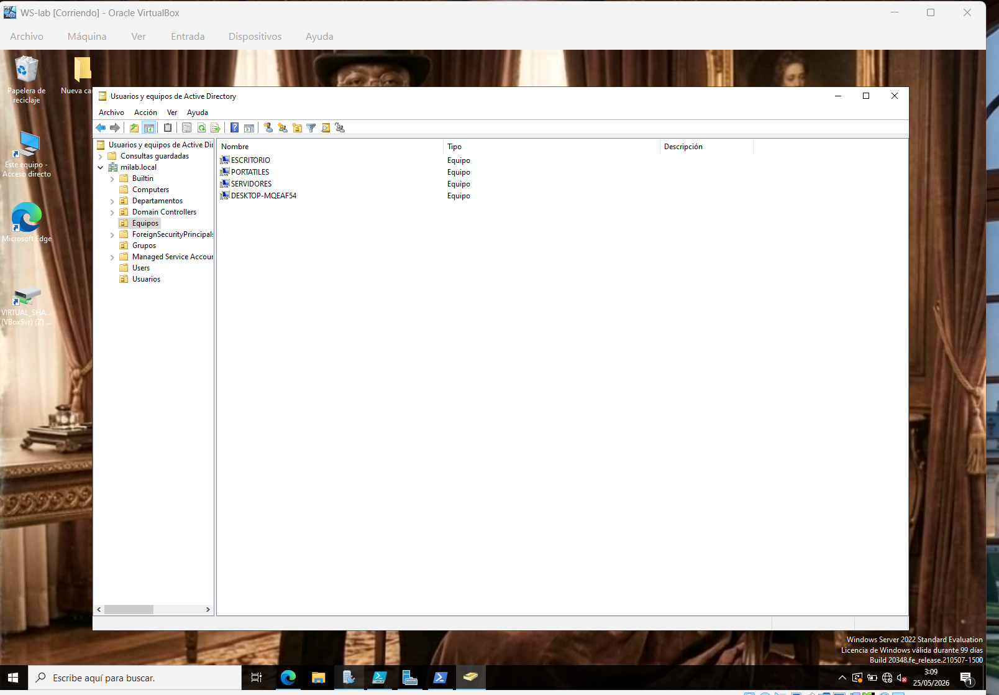
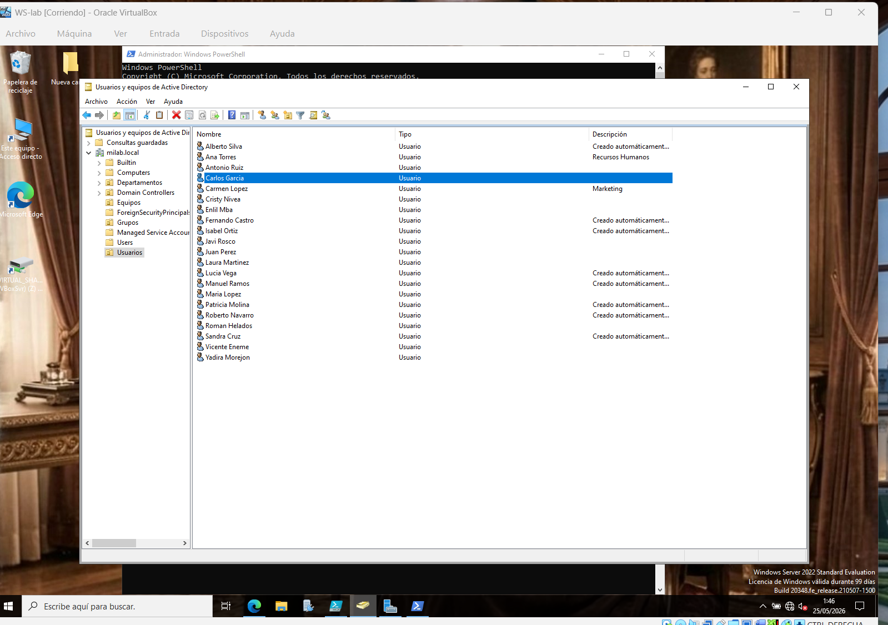
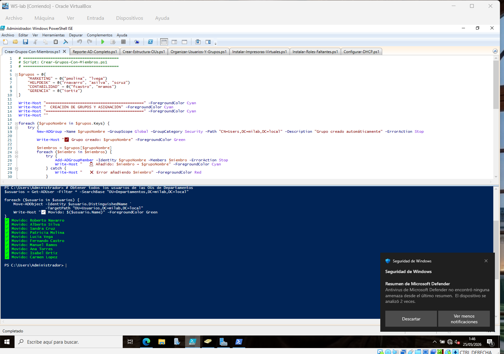
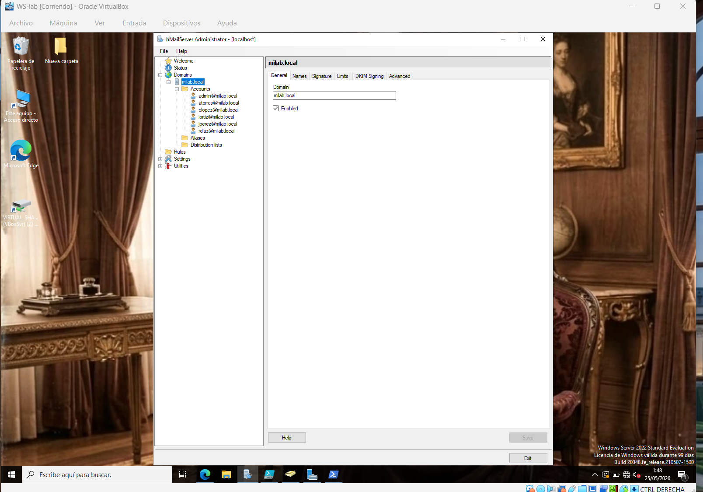
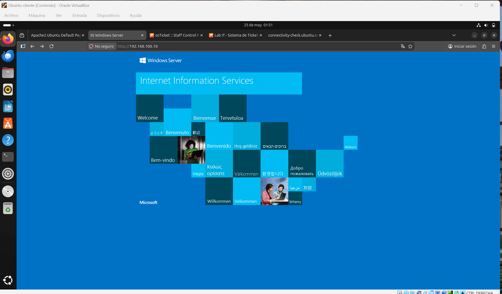
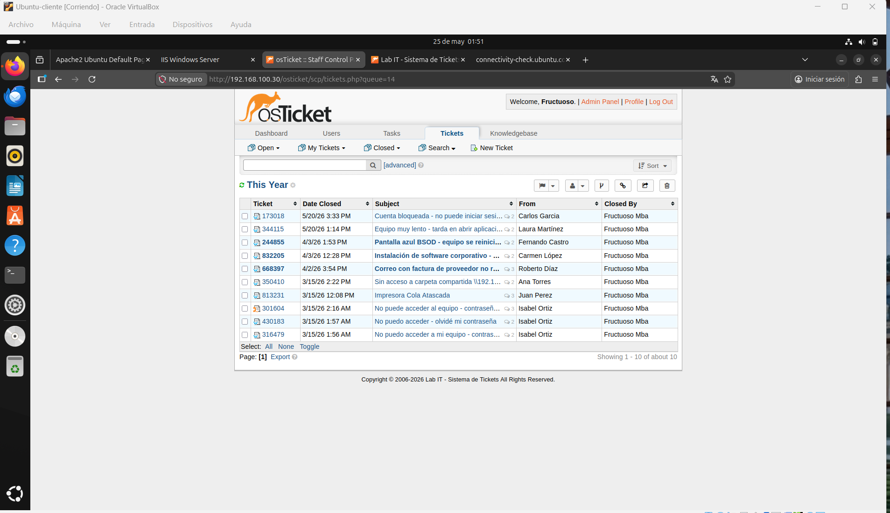
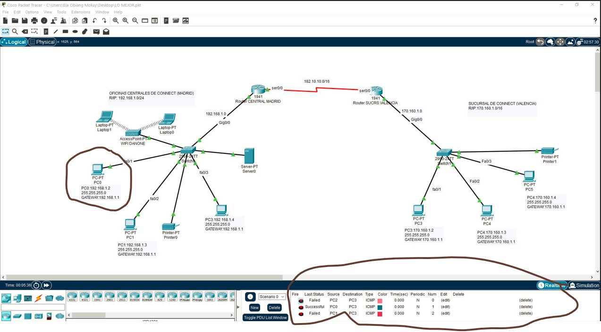
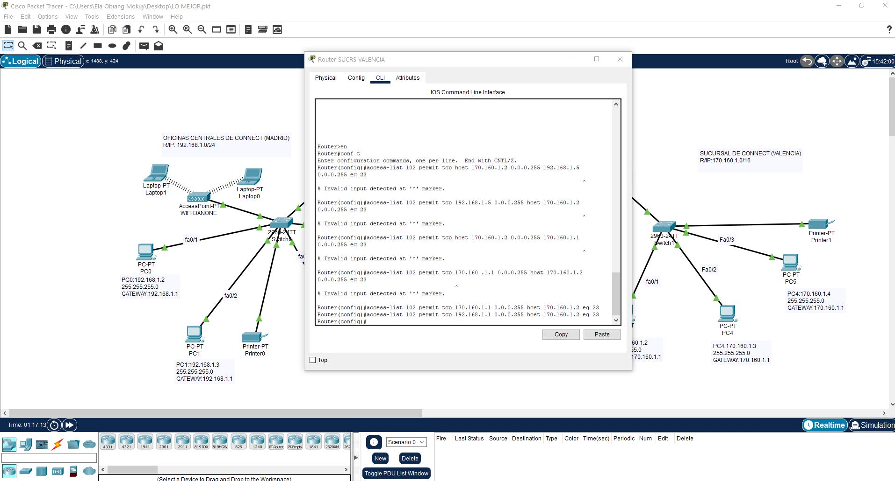

# Homelab IT: Dominio AD Virtualizado + Laboratorio Redes N1/N2

**Proyecto para reincorporación al sector IT como Técnico N1/N2 en Madrid**

[LinkedIn](https://www.linkedin.com/in/fructuoso-mba-o-fernadez-3a64142a9/) | Email: [pon tu email aquí]

---

## 🎯 Objetivo

Tras 9 años en NOC de telecomunicaciones y unos años fuera del sector, he montado este laboratorio virtualizado para actualizar competencias y optar a puestos de Técnico de Sistemas N1/N2.

## 🛠️ Entorno del Laboratorio

| Categoría | Tecnología |
| --- | --- |
| **Virtualización** | VMware Workstation / Hyper-V |
| **Sistema Operativo** | Windows Server 2022 Datacenter |
| **Dominio** | `milab.local` con AD DS, DNS, DHCP |
| **Redes** | Cisco Packet Tracer para práctica de VLANs y ACLs |
| **Servicios** | hMailServer, IIS SMTP, MySQL, osTicket |
| **Automatización** | PowerShell básico |

> **Nota:** Todo el entorno está montado sobre máquinas virtuales. El objetivo es demostrar competencias N1/N2.

## 📋 Tareas Realizadas

1. **Active Directory:** Instalación AD DS, 25 usuarios en OUs, GPOs para unidades de red
2. **Servicios de red:** DNS, DHCP configurados y funcionales
3. **Correo interno:** hMailServer + IIS SMTP con dominio `@milab.local`
4. **Helpdesk:** osTicket conectado a MySQL para gestión de incidencias
5. **PowerShell:** Scripts para alta de usuarios
6. **Packet Tracer:** Topologías con VLANs y ACLs básicas

## 📸 Evidencias del Laboratorio

### Active Directory y PowerShell
| Equipos en AD | Usuarios AD | PowerShell |
| --- | --- | --- |
|  |  |  |

### Servicios Desplegados
| hMailServer | IIS SMTP | osTicket |
| --- | --- | --- |
|  |  |  |

### Laboratorio de Redes
| Topología Packet Tracer | ACLs en CLI |
| --- | --- |
|  |  |

## 🚀 Competencias N1/N2 Demostradas

- Instalación Windows Server y promoción a Domain Controller
- Gestión de usuarios, grupos y permisos NTFS
- Troubleshooting básico DNS/DHCP
- Soporte a usuarios con sistema de tickets
- Documentación técnica y ganas de aprender

## 📞 Contacto 632965062

**Busco oportunidad como Técnico N1/N2 en Madrid.** 
Aporto experiencia en entornos críticos 24x7 + homelab práctico.

- **LinkedIn:** [Fructuoso Mba O. Fernandez](https://www.linkedin.com/in/fructuoso-mba-o-fernadez-3a64142a9/)
- **Email:** taskien666@gmail.com

**Tecnologías:** `Windows Server` `Active Directory` `DNS` `DHCP` `PowerShell` `Packet Tracer` `hMailServer` `osTicket` `N1` `N2`
